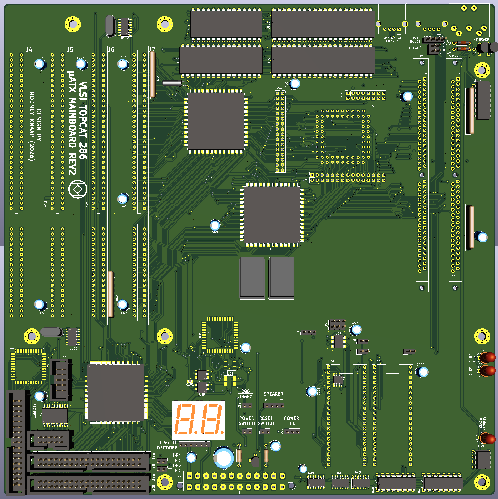

# ATX_TOPCAT_286_Mainboard_V2  
REV2 design for the VLSI TOPCAT ATX 286 mainboard  

A more elaborate preview of the design in progress, to be updated after final changes are added:   

  

After building the somewhat limited version of the TOPCAT "V1", we now have a proof of concept for how to create a 286 system with the VLSI TOPCAT chipset.  
sqpat sent us some VLSI chips and Intel versions of the 331 companion chip. I have tested these on a MSI TOPCAT 386SX board so they are valid equivalents for the VLSI 331.  

Now we know the concept is correct, we can elaborate the design further.  
We will add some CPLD support for additional hardware. The mainboard gerbers will be at least available in micro-ATX format since much is integrated and for those who want a micro tower build, and additionally I will probably feature a full sized gerber set as well for those who want more ISA slot connectors and a larger case.  
Check below for the further details of this design.  

## Purpose and permitted use, cautions for a potential builder of this design  

This project was created for historical purposes out of love for historical computing designs and for the purpose of enabling computing enthousiasts with a sufficient level of building and troubleshooting expertise to be able to experience the technology by building and troubleshooting the hardware described in this project. Due to the level of this project, it may be suitable as a project for students to get into. If there are any questions from teachers who like to teach about this technology I would be happy to answer them. It may be really interesting to analyse the elaborate and complex CPU timing and 8 bit to 16 bit data byte translation and DMA mechanisms in an educational setting.

Besides the GPL3 license there are a few warnings and usage restrictions applicable:
No guarantees of function or fitness for any particular or useful purpose is given, building and using this design is at the sole responsibility of the builder.

Do not attempt this project unless you have the necessary electronics assembly expertise and experience, and know how to observe all electronics safety guidelines which are applicable.

It is not permitted to use the computer built from this design without the assumption of the possibility of loss of data or malfunction of the connected device. To be used strictly for personal hobby and experimental purposes only. No applications are permitted where failure of the device could result in damage or injury of any kind.

If you plan to use this design or any part of it in new designs, the acknowledgement of the designer and the design sources and inspirations, historical and modern, of all subparts contained within this design should be included and respected in your publication, to accredit the hard work, time and effort dedicated by the people before you who contributed to make your project possible.

No guarantee for any proper operation or suitability for any possible use or purpose is given, using the resulting hardware from this design is purely educational and experimental and not intended for serious applications. Loss of data is likely and to be expected when connecting any storage device or storage media to the resulting system from this design, or when configuring or operating any storage device or media with the system of this design.

When connecting this system to a computer network which contains stored information on it, it is at the sole responsibility and risk of the person making the connection, no guarantee is given against data loss or data corruption, malfunctions or failure of the whole computer network and/or any information contained inside it on other devices and media which are connected to the same network.

When building this project, the builder assumes personal responsibility for troubleshooting it and using the necessary care and expertise to make it function properly as defined by the design. You can email me with questions, but I will reply only if I have time and if I find the question to be valid. Which will probably also lead to an update here. I want to primarily dedicate my time to new project development, I am not able to do any user support, so that's why I provide the elaborate info here which will be expanded if needed.

# PicoGUS  
I have asked polpo and he has kindly given me permission to add the PicoGUS into the design.  

The PicoGUS is created by polpo here on GitHub  
https://github.com/polpo/picogus  
Licensing conditions for PicoGUS parts apply as defined in the picogus repository.  

The license of PicoGUS applies to all parts of PicoGUS integrated into this system:  
The hardware portions of the PicoGUS repository (hw/ directory) are licensed under the CERN OHL version 2, permissive.  

The software portions of the PicoGUS repository (sw/, pgusinit/ directories) as a collection are licensed under the GNU GPL version 2. Some files are individually dual-licensed under BSD or MIT licenses – see the license in the file headers for details.  

PicoGUS is always under development by polpo so it's always in a beta status.  
When building this mainboard project, the intellectual property and conditions of the PicoGUS project must be respected and observed.  
Not to be sold for profit and design is "as-is" without any guarantees.   
Builders must take their own responsibility in debugging the PicoGUS from the provided information in the PicoGUS repo.  

Only build the PicoGUS parts of you agree with the conditions of the PicoGUS project by polpo, same as if you were building a stand alone PicoGUS.  
Many thanks go out to polpo for agreeing with PicoGUS to be included in this project!  
Be sure to check out his repo because he is always developing the PicoGUS further!  
My design is non standard so please don't contact polpo to get support for this deviated design, and await my testing of the first build done this way.

My integration of the PicoGUS will be experimental at first to use PLCC logic to drive the PicoGUS control.  
So before testing there is no verification of this design. The CPLD is fast and reprogrammable so possibly modifications can be done in the future by reprogramming the CPLD support logic. It is my hope that having this in place, we may succeed to get the PicoGUS to work correctly.
The bus switch logic is really fast as long as the OE function of the bus switch is not used so we don't get any on/off time involved in the timing.
Bus switches used in the PicoGUS to multiplex between address and data bus to reduce pin usage on the RP2040 side are bidirectional.
What level of IO data transfer commands are possible will depend on testing.
The IO reads and writes are both by the CPU and by the 8 bit DMAC in this implementation.
I have integrated the two RP2040 modules to the system RESET procedure so each time the system is RESET, the RP2040s also are RESET on the RUN input.  
RP2040 RESET is driven by separate output on the CPLD so we can modify or expand the RESET behavior if needed. For example using a software controlled RESET for the RP2040s.  

# Big news regarding AMI BIOS support for the 286 CPU!  
A TOPCAT AMI BIOS has been adapted by sqpat to make use of a more advanced AMI BIOS previously developed for a TOPCAT 386SX system.  
This has led to a substantial speed up of the REV1 TOPCAT 286 system to run RealDOOM at 6.85 frames per second, 8.6 frames per second in 3D bench.  
At maximum 22.4 MHz the REV1 ATX TOPCAT system also featured in my repositories can perform 14922 writes and 11115 reads per millisecond to system DRAM.  
Many thanks go out to sqpat who has made a repo for his work on the disassembled code:  
https://github.com/sqpat/topcatbios  
If interested, do check out the code for various comments by sqpat and results of his code examination!  
So we now have a much faster and more responsive TOPCAT 286 system with the REV1 system capable of running at 22.4MHz!  
The advanced AMI BIOS allows us to fully tweak the TOPCAT chipset to maximize the performance as far is it is able to go!  

# Updated feature list of this second revision  
The design work is currently in progress but nearing completion.  

Feature list for this design:  
- 286 featured in a PLCC socket for being able to swap the CPU  
- micro ATX board size qualifying as a normal and not large board size with JLCPCB
- two 72 pin SIMM DRAM modules
- verified IO decoder design areas inherited from REV3E
- support for removable 386SX module using pinheader connectors
- CPLD logic controls 286/386SX mode switch using single header input pin for switch or jumper
- optional dual system BIOS supported for 286/386SX using 1 megabit flash ROM
- 64KB option ROM space support on system data bus using the CPLD
- primary and secondary IDE port
- POST LED display
- LPT port (from REV3E design, not yet tested, needs connector wiring)
- USB to serial mouse using RP2040 by limeprogramming
- PicoGUS by polpo integrated (CPLD support logic and access speed not yet tested)
- BUSCLK on separate oscillator which can be swapped or possibly removed for experimental testing
- optional series termination resistors added for the fast clocks
- optional series termination resistor footprints present for possibly improving edges of fast signals such as DRAM address and controls

Using 4 megabit 4 bit wide DRAMs on 72 pin SIMMs reduces the DRAM and CPU data bus load by a substantial factor.  

Please take clear note of the fact that including series termination resistors does not mean that these must be populated.  
Whether these will remain a part of the recommended build will depend on testing and measurements.  
I will update depending on the findings and a definitive partslist regarding the recommended series termination footprints will follow from those. Possibly certain footprints will be changed to zero ohm resistors if no improvement or any negative effects are found.

So we are using the dual IDE port IO decoder from REV3E which has operated flawlessly in the REV3D.
From now on we can also monitor the POST reporting on port 80 by AMI BIOS on the POST LED displays present on the board.  

We switch over the system between 286 and 386SX using CPLD logic. This allows us to seamlessly change the CPU mode and CPU RESET control of the TOPCAT and direct the appropriate CPU to the RESET. In addition we have a double space ROM which provides us with two system ROM banks which can be switched over by the CPLD. The idea is to also control the ROM bank by the same mechanism which selects the CPU, so the system is fully adaptable between 286 and 386SX where we also can use separate system BIOS. In addition, the system ROM bank can be used in other ways to switch between two BIOS versions independent from CPU selection if desired.  

## Option ROM support  
The TOPCAT itself internally doesn't support option ROM BIOS chip select decoding. So the option ROM needs to be added to a TOPCAT system as if it were on a slot card. So the ROM is wired to the system data bus to be able to support this in a compatible way as the TOPCAT directs the data bus. The option ROM is enabled only sub 1MB address range as the PC/AT offers using /SMEMR and then decoded from this range in order to need less address lines to the CPLD. The option ROM offers 64KB of option ROM space which does not necessarily need to be adjacent in the memory map. Where the ROM is inserted into the memory map is freely reprogrammable within the A15 address line selection the CPU does in a certain memory area. Typical use way will be to insert half of the ROM(32KB) into the 0C8000h - 0CFFFFh area.
Theoretically a VGA BIOS can be programmed into the ROM for a custom VGA solution such as FPGA based VGA output using its own VGA BIOS, and the CPLD can be reprogrammed to enable the option ROM in this area of the memory map.  

The LPT1 port is inherited from the REV3D and REV3E designs however this has not been tested yet. The REV3D/E and LPT design here is partially implemented externally with two TTL ICs because of limited 6 different output enable function capability of the CPLD. The decoding and control signals of the LPT port are all handled by the CPLD internally.  

Two flatcable wires need to be soldered to connect the 25 pin female LPT D-connector to the board. In this case I have separated the LPT data port and control port into two separate headers because of the limited PCB space available in that board area where a single longer header cannot fit.  
Using the two 10 pin flatcable boxheaders and cable solution is mostly straight forward however additional care must be observed to clearly label the connectors making sure that these are always inserted into the correct headers when using the printer port. If the LPT port is not used, the TTL chips can be left off the board, and IO pins from the CPLD present on the 10 pin LPT control header can be used for other purposes. Generally the TTL chip clocked data register can also be repurposed for various other IO port operations and experiments if the user likes. So the data output is clocked and output enable controlled, the data input can be directly read by the CPU from the header data bits using a single output enable.

Further updates will follow.

Last update:  

25-4-2026
